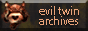

+++
title = "About"
date = "2014-04-09"
lang = "en"
+++

# About

## À propos

 I tried to translate as far as I can all information about Evil Twin. This is more globish than proper English, but I hope you’ll find good informations. 

## Credits

- CMS : [Zenphoto](https://www.zenphoto.org/)
- Fonts : [Cooper Hewitt](https://www.cooperhewitt.org/open-source-at-cooper-hewitt/cooper-hewitt-the-typeface-by-chester-jenkins/) & [Zangezi](https://futurefonts.xyz/daria-petrova/zangezi)
- Scripts : [ResponsiveNav](http://responsive-nav.com/), [SimpleLightbox](https://simplelightbox.com/), [macy.js](https://github.com/bigbite/macy.js), [Juxtapose.js](https://juxtapose.knightlab.com/)
- Magazines : [Abandonware Magazines](https://abandonware-magazines.org/) & [Archive.org](https://archive.org/)
- Evil Twin : In Utero & Ubi Soft

Good old bann  
