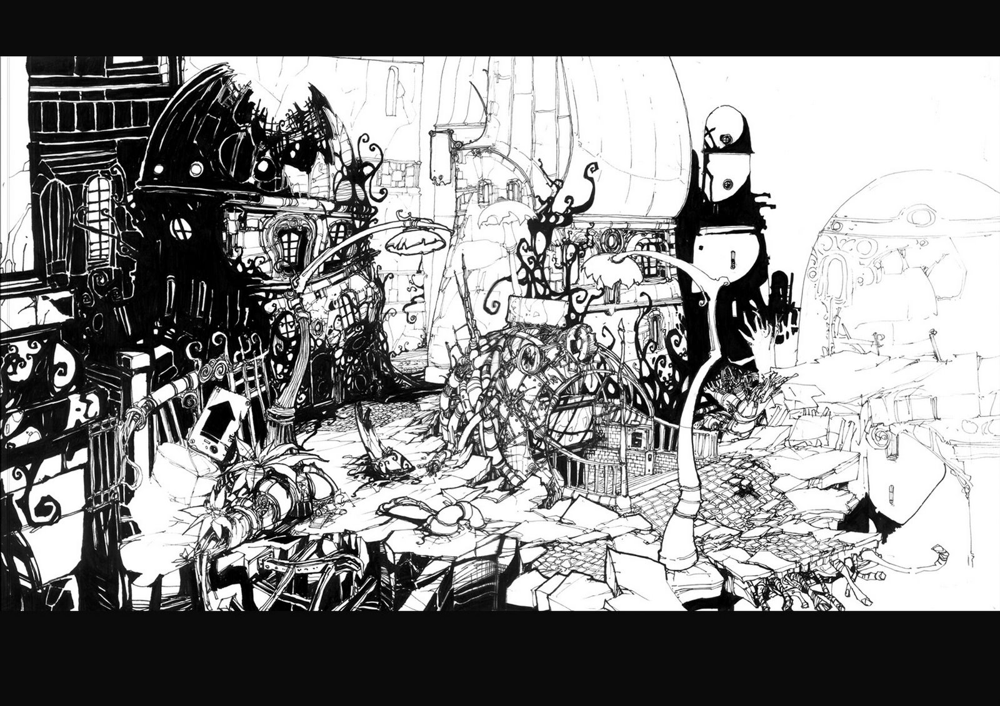
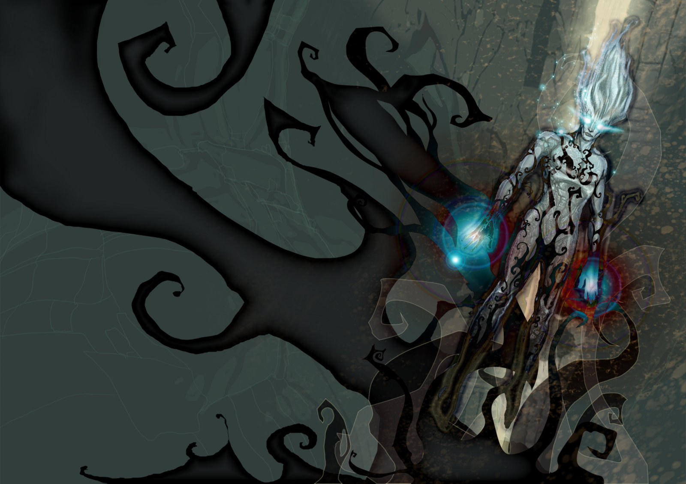
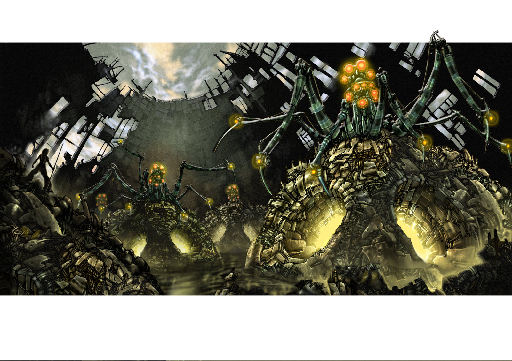
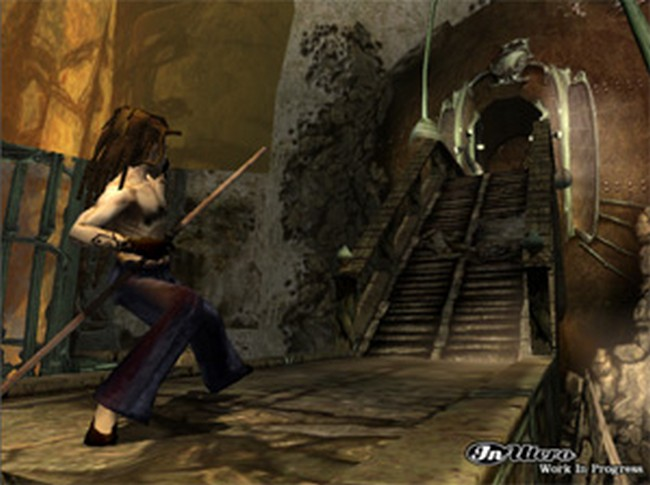
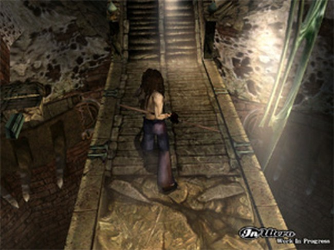

# Evil Twin 2 : The Messenger 

## The cancelled sequel 

In Utero start working on a sequel just before the end of the society. As a former developer wrote on [Adventure Gamers](https://adventuregamers.com/archive/forums/general/5399-evil-twin.html#post_message_89327) in 2004.

> “And too bad we couldn't do Evil twin 2 because it would have been a much much better game, considering we wouldn't have had the same problems with our middleware which was in development during production...”

Around 2010 [sketches and roughts](https://en.eviltwin.vibvib.fr/evil_twin_2_messenger/) where available on a Picasa account from a former employee of In Utero. And [Bertrand Eluerd](https://bertrandeluerd.bandcamp.com/album/evil-twin-cypriens-chronicles-vol-i), put online some music about Evil Twin 2 on his bandcamp page.

   

Finally, on 2019, [Unseen64](https://www.unseen64.net/2019/07/05/evil-twin-2-messenger-cancelled/) wrote an article with the testimony of omar Cornut and two screenshots of the WIP game.

 

There is also a game, called *Carnival: Theorem One*, which as been in development on PSP before being cancelled too. This game was developed by three ex-members of In Utero and inspired by their work on Evil Twin 2.

> “After the company closed Diego, Nino and Cedric from In Utero formed their studio Fandango working on a PSP game called Carnival: Theorem One which I think was inspired by those early Evil Twin 2 design.”

<video src="https://en.eviltwin.vibvib.fr/albums/videos/carnival-psp-trailer.mp4" controls="" poster="carnival-psp.jpg" class="bigspace mini_video">
Votre navigateur ne prend malheureusement pas en charge ce format vidéo.
</video>